Git Starter Guide
=================

Git Features
------------

Git and SVN differences
~~~~~~~~~~~~~~~~~~~~~~~

- Git is much faster than Subversion​
- Subversion allows you to check out just a subtree of a repository; Git requires you to clone the entire repository (including history) and create a working copy that mirrors at least a subset of the items under version control.​
- Git's repositories are much smaller than Subversions (for the Mozilla project, 30x smaller)​
- Git was designed to be fully distributed from the start, allowing each developer to have full local control​
- Git branches are simpler and less resource heavy than Subversion's​
- Git branches carry their entire history​
- Merging in Git does not require you to remember the revision you merged from (this benefit was obviated with the release of Subversion 1.5)​
- Git provides better auditing of branch and merge events​
- Git's repo file formats are simple, so repair is easy and corruption is rare.​

Git major features over subversion
~~~~~~~~~~~~~~~~~~~~~~~~~~~~~~~~~~

- Distributed Nature​
- Access Control​
- Branch Handling
- Performance (Speed of Operation)​
- Smaller Space Requirements

Using Puttygen
--------------

Purpose
~~~~~~~
Puttygen is a tool that you can use to convert private keys into different formats.
You can also use this tool to generate a public key from a given private key.

Convert Private Key
~~~~~~~~~~~~~~~~~~~
You will receive a private key from JP that is using the RSA format. In order to use it in Tortoisegit, you need to convert it to OpenSSH format first using Puttygen. 

The following illustrates the steps:

- Open puttygen. Puttygen is included when installing Tortoisegit.

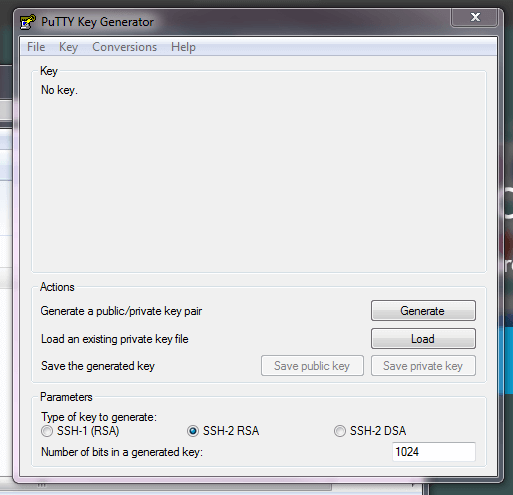

- Go to File, then "Load Private Key".
	
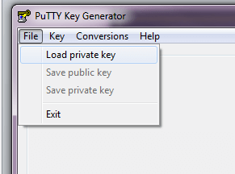

- Select your private key. The private key provided by JP is usually named after you (e.g. christian.gabo).	
	
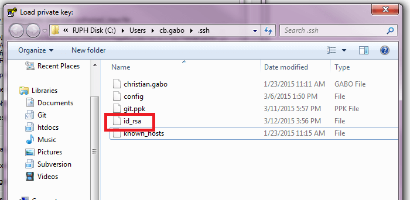

- Click the "Save private key button".	
	
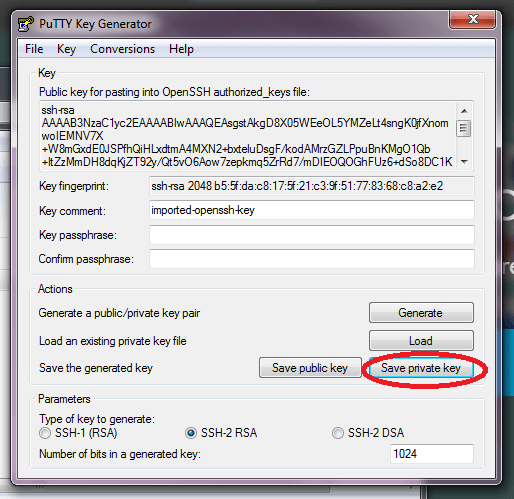
	
- Choose the location where you want to save the private key. You can name it whatever you want. 	

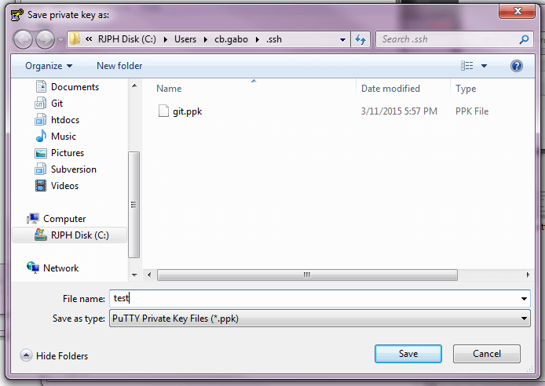

- A file with *.ppk extension is then generated. You can now use this files to access git repositories using Tortoisegit.
	
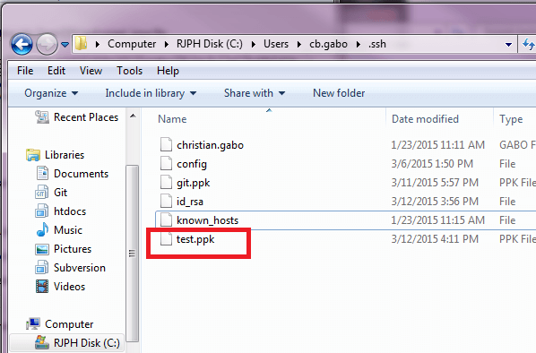
	
Cloning a new Repository	
------------------------

Using Tortoisegit
~~~~~~~~~~~~~~~~~	

- Go to any folder. Right-click and then select "Git Clone".

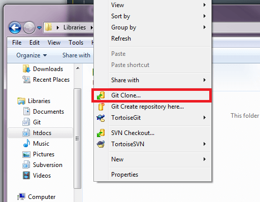
	
- Provide the URL of the repository to be cloned. (e.g. git@rsds.rarejob.com:app-ph/deborah.git). Don't forget to select the private key you generated earlier as well. It has a *.ppk file extension. 	
	
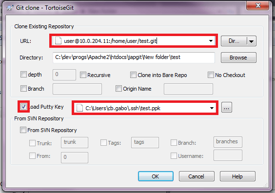
	
- Upon clicking the "Ok" button, the cloning will start and you will see a message similar to one shown below.
	
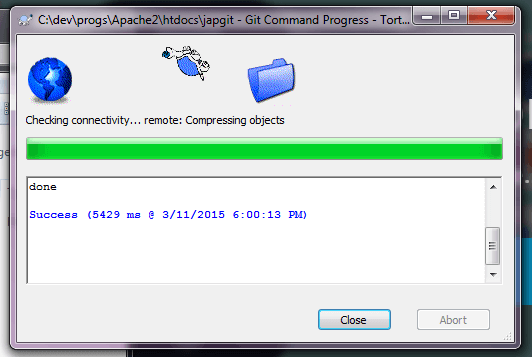
	
- You will now see that the repository has been cloned successfully in the path you provided.
	
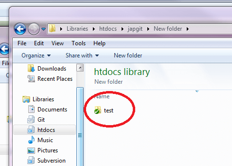
	
Committing and Pushing	
----------------------

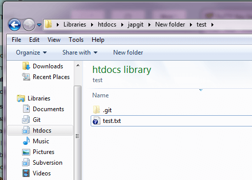

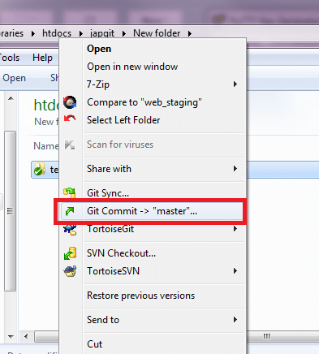

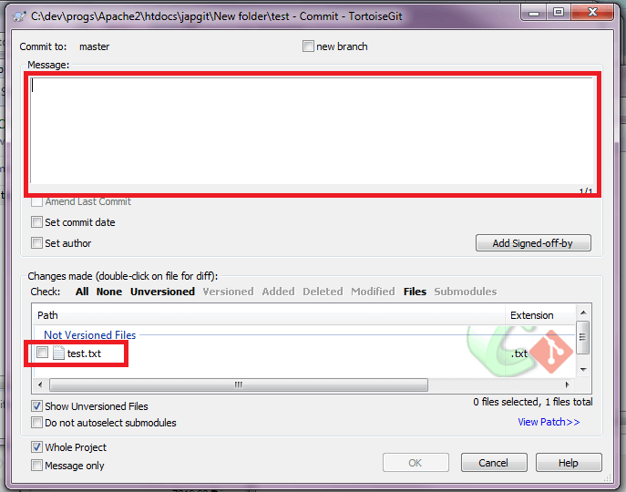

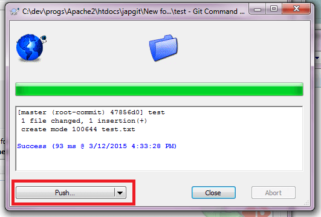

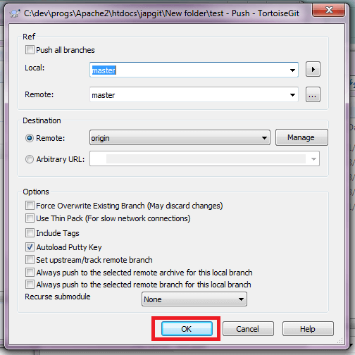

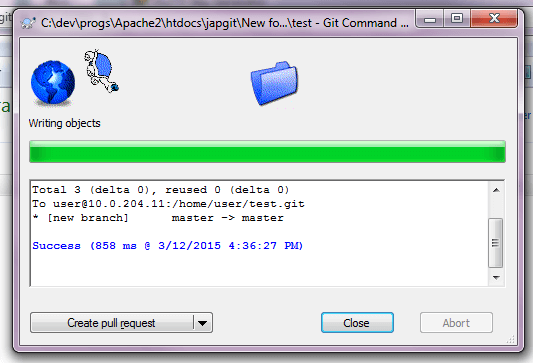
	

Branching
---------

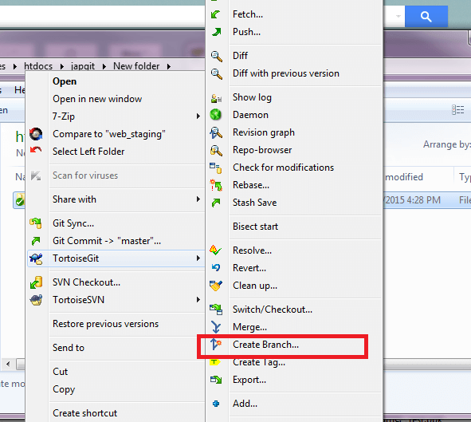

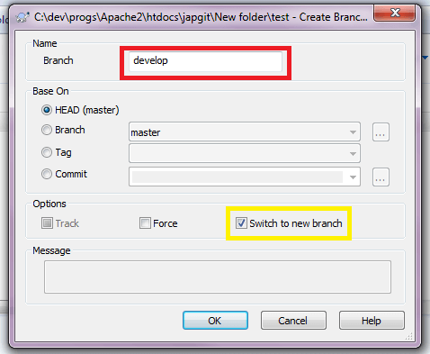

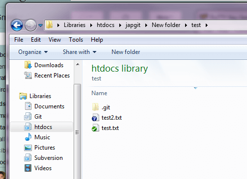

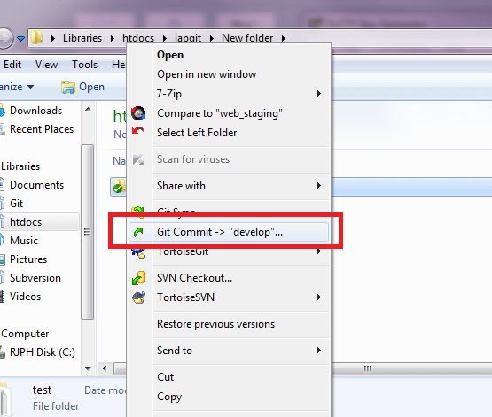

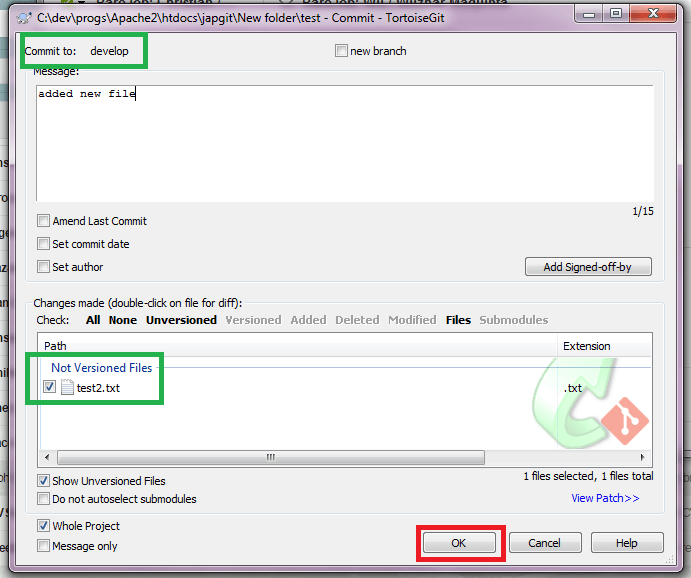

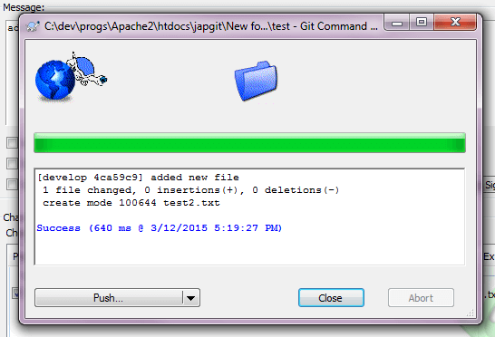

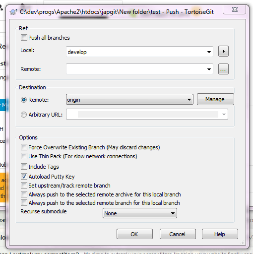

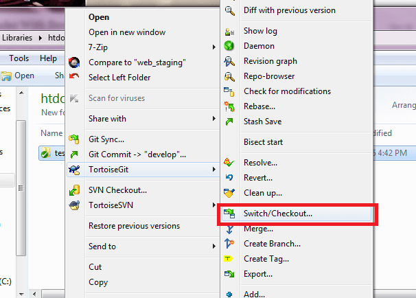

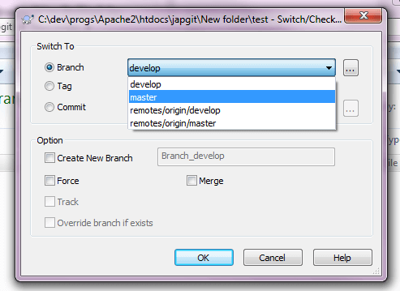

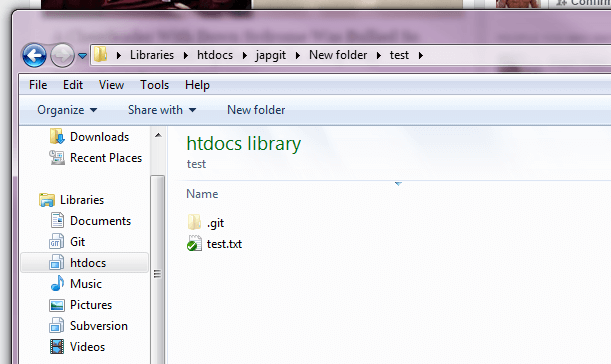
	
Merging
-------

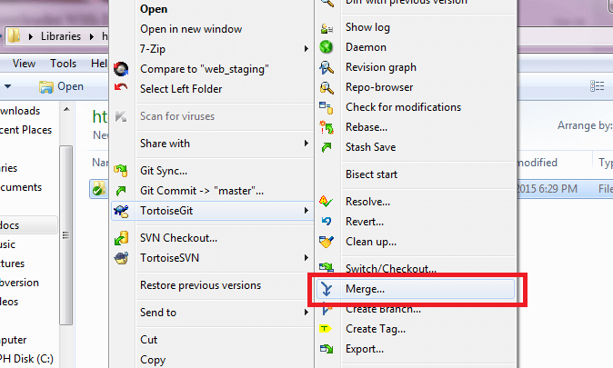

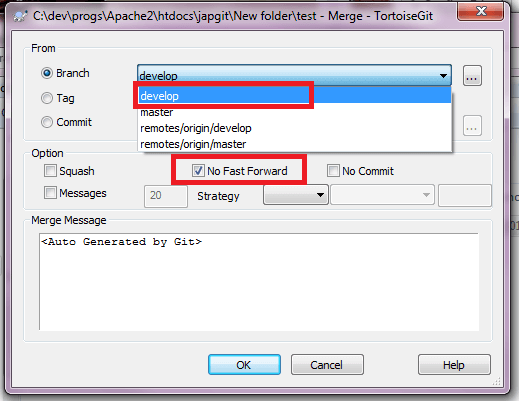

	