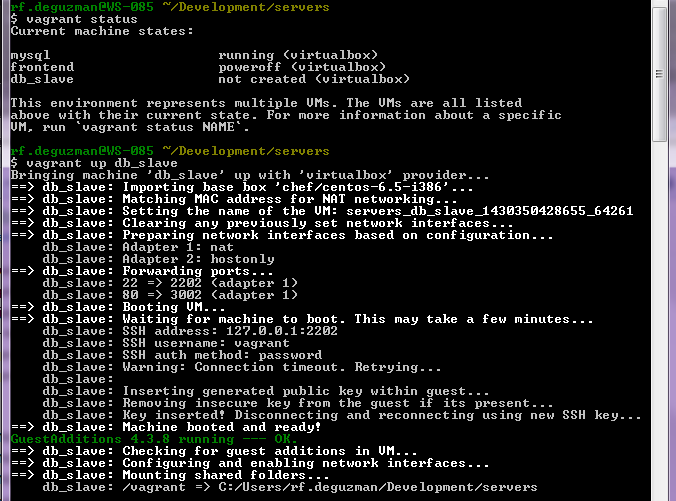
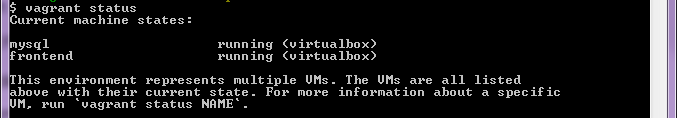
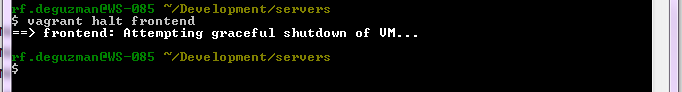
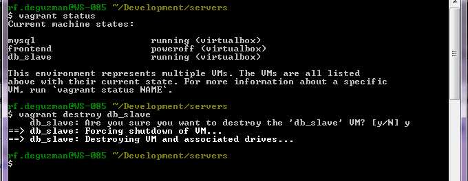
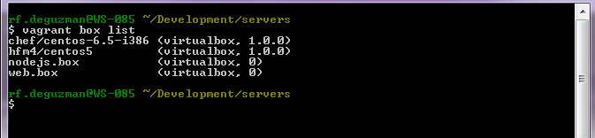
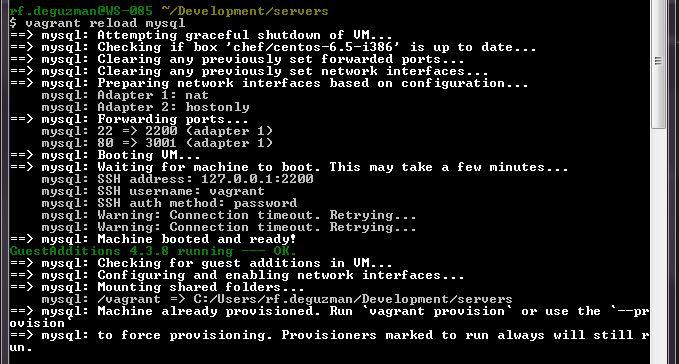

Vagrant
=======

Why vagrant?
------------

Vagrant provides easy to configure, reproducible, and portable work environments built on top of industry-standard technology and controlled by a single consistent workflow to help maximize the productivity and flexibility of you and your team.

Machines are provisioned on top of VirtualBox, VMware, AWS, or any other provider. Then, industry-standard provisioning tools such as shell scripts, Chef, or Puppet, can be used to automatically install and configure software on the machine.

How vagrant benefits you
------------------------

Vagrant will isolate dependencies and their configuration within a single disposable, consistent environment, without sacrificing any of the tools you're used to working with (editors, browsers, debuggers, etc.). Once you or someone else creates a single Vagrantfile, you just need to "vagrant up" and everything is installed and configured for you to work. Other members of your team create their development environments from the same configuration, so whether you're working on Linux, Mac OS X, or Windows, all your team members are running code in the same environment, against the same dependencies, all configured the same way. Say goodbye to "works on my machine" bugs.

Installation
------------

- Download and install the approriate installer in "http://www.vagrantup.com/downloads"
- Download and install the approriate installer in "https://www.virtualbox.org/wiki/Downloads"

Getting started
---------------

1. open command line
#. cd to your project
#. type "vagrant init"
    
    * this will create Vagrantfile
    * open Vagrantfile and fillout the necessary options

#. type "vagrant up"
#. this will start the creation of your vagrant box or virtualbox machine

Vagrant file
-------------------------

This is a sample vagrant file that I use as development environment. It uses ruby syntax::

    Vagrant.configure(2) do |config|
  
      ##### MySql server #####
      
      config.vm.define :mysql, primary: true do |m|
        m.vm.box = "chef/centos-6.5-i386" // base box from hashicorp
          
        m.vm.network :private_network, ip: "192.168.210.10"
        config.vm.network :forwarded_port, id: "ssh", guest: 22, host: 2200
        m.vm.network :forwarded_port, guest: 80, host: 3000
        m.vm.provision :shell, :run => 'always', :inline => <<-SH
            sudo service mysqld restart
        SH
      end

      ##### Frontend server #####

      config.vm.define :frontend, primary: true do |f|
        f.vm.box = "chef/centos-6.5-i386" // base box from hashicorp
          
        f.vm.network :private_network, ip: "192.168.210.11"
        config.vm.network :forwarded_port, id: "ssh", guest: 22, host: 2201
        f.vm.network :forwarded_port, guest: 80, host: 3001
        f.vm.synced_folder 'C:/Users/rf.deguzman/Development/filecheck.dev', "/var/www/html", 
                            :create => true, :owner=> 'vagrant', 
                            :group=>'apache', :mount_options => ['dmode=775','fmode=775']
        f.vm.provision :shell, :run => 'always', :inline => <<-SH
            sudo service httpd restart
        SH
      end

    end 

After doing "vagrant up", I can access the web projects in http://192.168.210.11 or http://localhost:3001

Anything I change in "C:/Users/rf.deguzman/Development/filecheck.dev" will be reflected immediately in the virtual machines.

Note: After doing the initial "vagrant up", i did the ff (you only have to do this  once):

- ssh to 192.168.210.10
    
    * sudo yum -y install mysql mysql-server

- ssh to 192.168.210.11

    * sudo yum -y install php php-pdo php-mysqli php-mysql apache

List of vagrant base boxes
--------------------------

    - https://atlas.hashicorp.com/boxes/search
    - http://www.vagrantbox.es/

Vagrant commands
----------------

vagrant up
~~~~~~~~~~

vagrant status
~~~~~~~~~~~~~~

vagrant halt 
~~~~~~~~~~~~~~~~~~~~~~~~~~~~~~~~~

"vagrant halt" stops all machines
"vagrant halt [machine]" stops the specific machine

vagrant destroy
~~~~~~~~~~~~~~~

vagrant box list
~~~~~~~~~~~~~~~~

Shows all base boxes that you have downloaded.

vagrant reload
~~~~~~~~~~~~~~

"vagrant reload" reloads/reboots all machines

"vagrant reload [machine]" reloads/reboots specific machine

