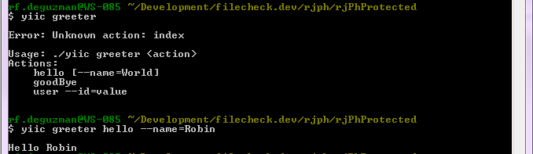

.. _yiicronjob:

Running ConsoleCommands as CRON jobs
====================================

This will show you how to create consoleCommands and to run them either via command prompt or as cronjobs.

First, make sure you have the required files

/project-name/protected/yiic::

    #!/usr/bin/env php
    require_once(dirname(__FILE__).'/yiic.php');

/project-name/protected/yiic.bat::

    @echo off
    rem -------------------------------------------------------------
    rem Yii command line script for Windows.
    rem This is the bootstrap script for running yiic on Windows.
    rem -------------------------------------------------------------
    @setlocal
    set BIN_PATH=%~dp0
    if "%PHP_COMMAND%" == "" set PHP_COMMAND=C:/xampp/php/php.exe
    "%PHP_COMMAND%" "%BIN_PATH%yiic.php" %*
    @endlocal

/project-name/protected/yiic.php::

    <?php
    // change the following paths if necessary
    $yiic=dirname(__FILE__).'/../../../yii/framework/yiic.php';
    $config=dirname(__FILE__).'/config/console.php';
    require_once($yiic);

/project-name/protected/config/console.php::

    <?php
    // This is the configuration for yiic console application.
    // Any writable CConsoleApplication properties can be configured here.
    // As you can see, it's pretty much the same with /sitename/protected/config/main.php
    // add enableIncludePath if you get an error that
    // classes are not found ie. Staff not found
    Yii::$enableIncludePath = FALSE;
    return array(
        'basePath'=>dirname(__FILE__).DIRECTORY_SEPARATOR.'..',
        'name'=>'RJCS Console Application',

        // preloading 'log' component
        'preload'=>array('log'),
            'import'=>array(
                'application.models.*',
                'application.components.*',
            ),
        // application components
        'components'=>array(
            // uncomment the following to use a MySQL database
            'db'=>array(
                'connectionString' => 'mysql:host=127.0.0.1;dbname=test_database',
                'emulatePrepare' => true,
                'username' => 'root',
                'password' => '',
                'charset' => 'utf8',
            ),
        ),
    );

Now, let's create a simple console command.

/project-name/protected/commands/GreeterCommand.php::

    class GreeterCommand extends CConsoleCommand
    {
      public function actionHello($name = 'World')
      {
        echo 'Hello '.$name;
      }
      public function actionGoodBye()
      {
        echo 'Good bye';
      }
      public function actionUser($id)
      { // stf_user table
        // yiic greeter user --id=4;
        // outputs Medina, Aaron
        $model = User::model()->findByPk($id);
        if(!$model)
          echo 'User not found';
        else
          echo 'Hello '.$model->nickname;
      }
    }

Let’s test this out in the command prompt. You can even see usage information via yiic help greeter

To set this console command to run as a cron job, we need to insert this in crontab::

    # run everyday @ 5:30pm
    30 17 * * * cd /var/www/html/project-name/protected && ./yiic greeter hello --name-Robin
    # or
    30 17 * * * cd /var/www/html/project-name/protected && php yiic.php greeter hello --name-Robin
